<h1 align="center">Yoga Flow Class Record</h1>

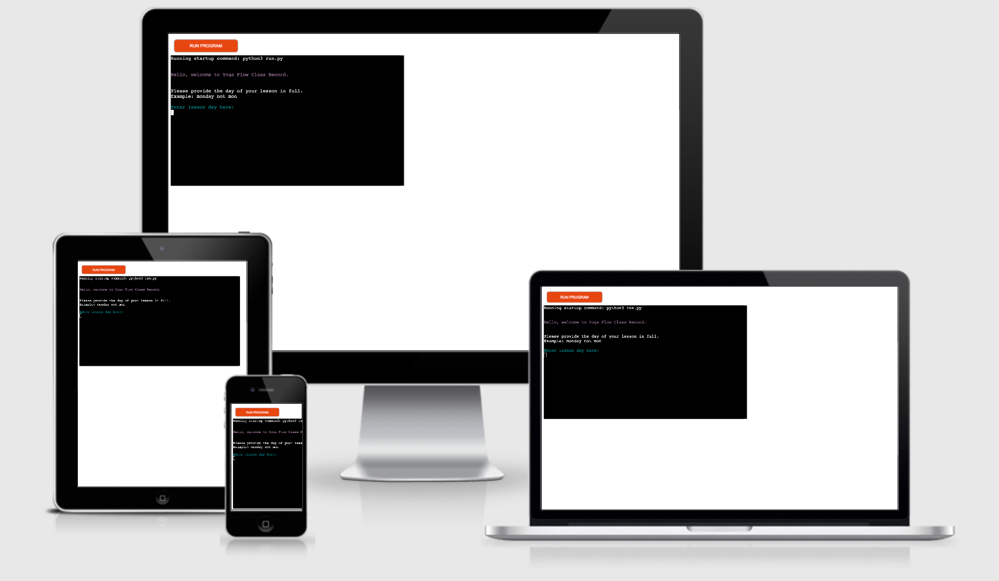 

**Live Site:**
[Yoga Flow Class Record Terminal](https://yoga-flow-class-record.herokuapp.com/)

**Repository:**
[Yoga Flow Class Record Repository](https://github.com/SamanthaBooth81/yoga-flow-class-record)

# About
This project is for users who teach lessons in any field who work for themselves. The aim is to collect lesson data from the user for the purpose of calculating earnings and updating the worksheet. 

It is made with the intention of helping a small business owner keep their financial information in order by keeping track of total earnings, both for the lesson added and a running total so far.

The calculations for the earnings of the class being added use the price data per class duration that is stored in a separate worksheet and the attendance data that is directly input by the user into the terminal. The terminal will then print the earnings to the user as well as store them back in the attendance worksheet. 

# Table of Contents

[User Experience](#user-experience)

[Features](#features)

[Features to be Implemented](#features-to-be-implemented)

[Technologies Used](#technologies-used)

[Testing](#testing)

[Validator Testing](#validator-testing)

[Bugs Found](#bugs-found)

[Deployment](#deployment)

[Credit](#credit)

[Acknowledgments](#Acknowledgments)

# User Experience
## User Stories
- As a self-employed teacher I want to:
    * Keep track of the business earnings
    * Plan for the future growth of the business 

# Features
## Input Data
Input of lesson data including:
1. Day
2. Date
3. Time

 
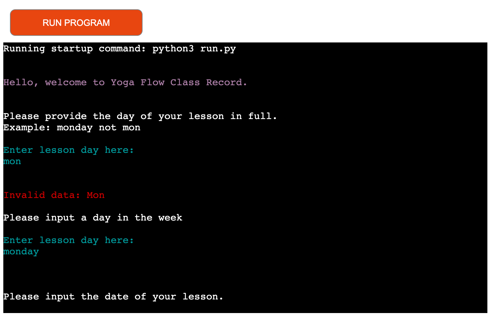 

4. Duration
5. Location 

 

6. Attendance and calculations

 

##  Calculations
- Calculate earnings per class and update spreadsheet
- Calculate the total of all inputted lessons

## Features to be Implemented
- Calculations of the busiest days in the week
- Analytics of the current timetable over the month to decipher:
    - Average student attendance per day
    - Busiest time period throughout the month
    - busiest time period throughout the year

The above should aid with decision making, such as making adjustments to the current timeable, running of workshops (when and where is best) and identifying capacity to add locations/lessons. 

# Technologies Used

## Languages Used

[Python](https://www.python.org/)

## Frameworks, Libraries and Programmes Used 

[GitHub](https://github.com/) - Used to hold a repository of my project and deploy the live website to Git Pages, making it public.

[GitPod](https://gitpod.io/workspaces) – Connected to GitHub, GitPod hosted the coding space, allowing the project to be built and then committed to the GitHub repository. 

[Heroku](https://www.heroku.com/) - Connected to GitHub repositiry, Heroku is a cloud application platform used to deploy this project so this backend language can be utilised/tested. 

[Google Sheets](https://workspace.google.com/intl/en_uk/products/sheets/?utm_source=google&utm_medium=cpc&utm_campaign=emea-gb-all-en-dr-bkws-all-all-trial-e-t1-1010042&utm_content=text-ad-crnurturectrl-none-DEV_c-CRE_146161043432-ADGP_Hybrid%20%7C%20BKWS%20-%20EXA%20%7C%20Txt%20~%20Sheets%20~%20General%20%232-KWID_43700012539607188-kwd-11403239008-userloc_20485&utm_term=KW_google%20sheets-g&ds_rl=1289227&ds_rl=1259922&ds_rl=1289227&gclid=Cj0KCQjwtMCKBhDAARIsAG-2Eu-ikZjdKWgK9omCfFHENiM0V260I6vw4zlmpc1cabn0Jyru79bRzmkaAjFMEALw_wcB&gclsrc=aw.ds) is used to create an online based spreadsheet.

[Google Sheets API](https://developers.google.com/sheets/api) is used to link into my spreadsheet.

[datetime](https://docs.python.org/3/library/datetime.html) to work with the date and time, ensuring it follows the correct format and doesn exceed the possible day and month.

[Colorama](https://www.youtube.com/watch?v=u51Zjlnui4Y) is used to add colour to the terminal which adds to the users experience.

# Testing

## Functionality 

The project follows the below logic: 

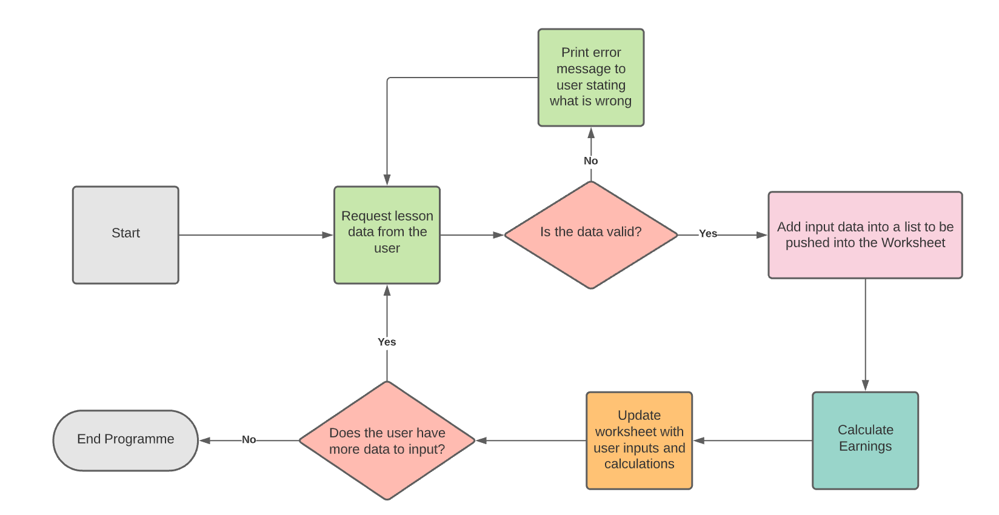 

The user must input each entry of data individually as each item has to be validated using different parameters. Once all data is input the system makes its calculations. These inputs and calculations are then pushed back into the approproate worlsheet. 

I have manually tested the projecy by:
- running through a PEP8 linter
- Intentionally added incorrect data to ensure the code rejects it 
- Tested both in Gitpod and Heroku terminals
- Ensured the data input from the deployed terminal pushes the data back into the worksheet as expected (see images below)

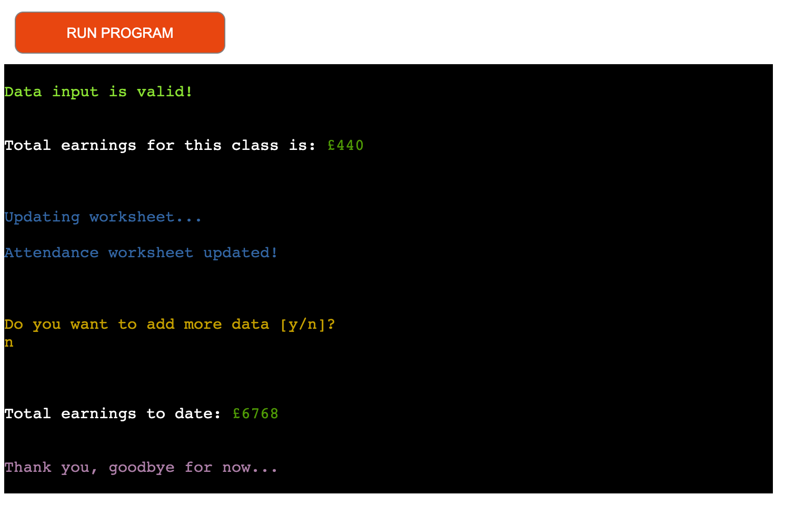 

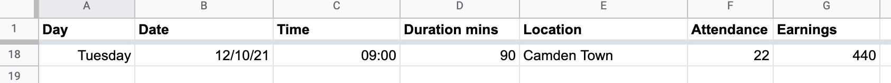 

# Validator Testing

The code was validated using [PEP8](http://pep8online.com/). No errors were retruned. 

# Bugs Found 

During testing I found that the date was not in the dd/mm/yy format I thought I had set it as. To fix this I changed the order of the following line of code from "day, month, year" to be "year, month, date":

<ins>my_date = date(int(year), int(month), int(day))</ins>

I also found that some user input errors were terminating the code although I used a while loop. To fix this I identified which lines of code were causing the errors using the Traceback in the terminal. What I found was the code that was causing the break in the loop wasn't within the while loop. To fix this I placed the code in the loop and function began to work as expected.  

Currently, there are no bugs found, however, the below pylint errors were appearing in the Problems tab:

 

I attempted to remove the errors however the variables I have stored globally were not working when moved into the module. Therefore I had to use the global keyword within the following functions:
- lesson_duration_data()
- lesson_location_data
- lesson_attendance_data

# Deployment 

This project was deployed using the Code Institutes mock terminal for Heroku. 

I followed the following steps:
1. Login to Heroku and Create a New App.

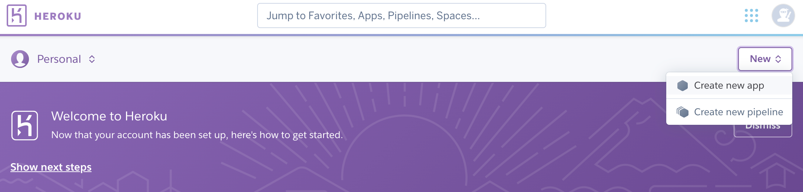 

2. Give the App a name, it must be unique, and select a region. 

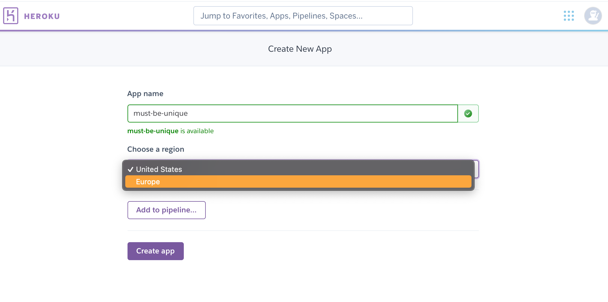 

3. Click on 'Create App'. This will take you to a page where you can deploy your project. 

4. Click on 'Settings' among the tabs at the top of the page. The following sets must be dione before deployment.

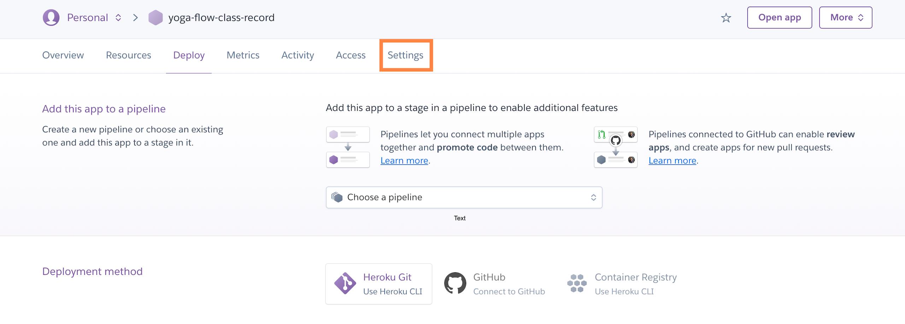 

5. Next, scroll down to Config Vars (also knownas Environment Variables). In order for Heroku to access my spreadsheet it must have access to the contents of the creds.json file. As this file is to be kept secure it cannot be found in my GitHub repository. To enable access securely, sensitive data is stored in a Config Vars. 

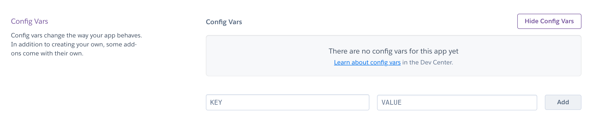 

6. Click 'Reveal Config Vars'. Where it says 'KEY', input CREDS and 'VALUE', input the contents of the creds.json file. Then click 'ADD'. 
I also had to add a second Config Vars of KEY: PORT and VALUE: 8000, to improve compatability with the Code Institute [Template](https://github.com/Code-Institute-Org/python-essentials-template) I am using.

7. Scroll down to Buildpacks. This adds futher required dependencies outside of the requirements.txt file. Click 'Add Buildpack', select 'python' first and then click 'Save Changes'. 
Then, add a second Buildpack, 'nodejs', to handle the mock terminal provided by The Code Institute.

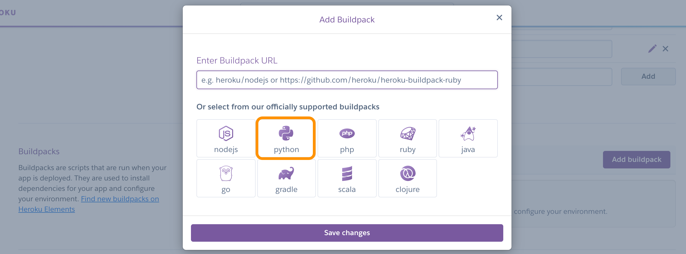 

**The order of these Buildpacks is intentional, ensure Python is on top and nodejs underneath. The order can be changed by clicking and dragging.** 

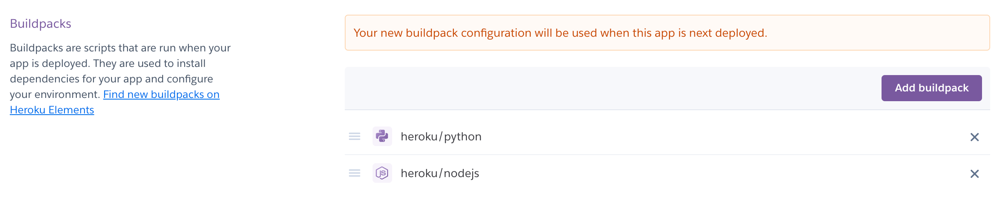 

8. Go to the 'Deploy' section using the tabs at the top. Find the 'Deployment Method' section and choose GitHub. Then, I connected to my relevant GitHub Repository by searching the repository name and clicking 'Connect'.

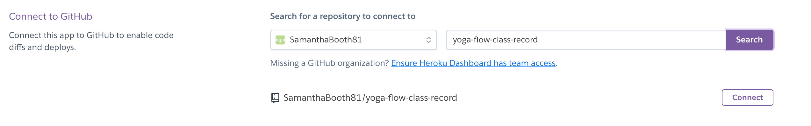 

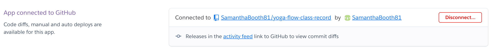 

9. Scroll down to the Automatic and Manual Deploys sections. I have enabled Automatic Deploys as I want my project to automatically redeploy if push any changes back into my repository. I then clicked 'Deploy Branch' in the Manual Deploy section and waited as Heroku installed all dependencies and deployed my code. 

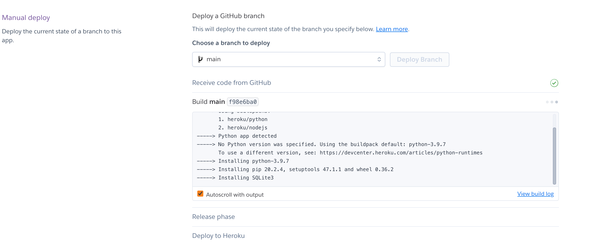 

10. Once my code was finished deploying I clicked view, to see my newly deployed project in the terminal. 

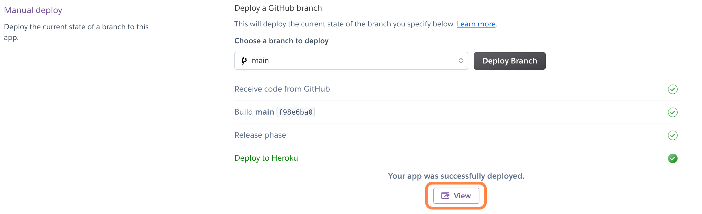 
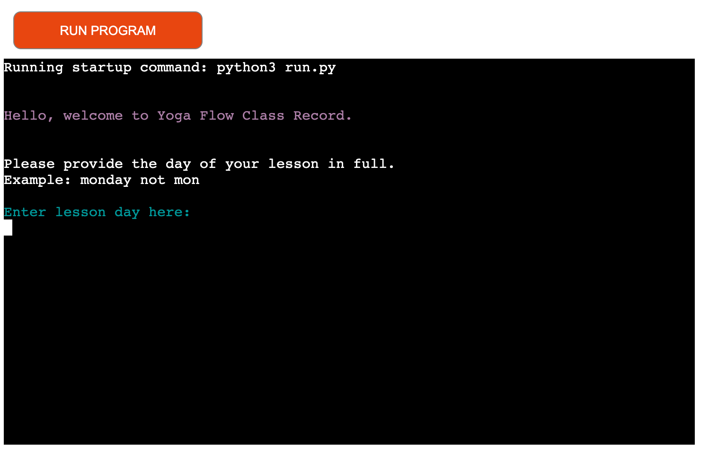 

# Credit
## Content 

I used [Stack Overflow](https://stackoverflow.com/questions/3944655/testing-user-input-against-a-list-in-python) to test user input against the lesson_day list.

I used [Stack Overflow](https://stackoverflow.com/questions/3944655/testing-user-input-against-a-list-in-python) to help with the while loop when writing the lesson day function. 

I used [Stack Overflow](https://stackoverflow.com/questions/5619489/troubleshooting-descriptor-date-requires-a-datetime-datetime-object-but-rec) to aid with ensuring the date can be validated correctly in the lesson_date_data function. 

I used this [Gspread Documentation](https://docs.gspread.org/en/latest/user-guide.html#getting-a-cell-value) to find out how to link to a column of data in a spreadsheet.

I used this [Colorama YouTube Video](https://www.youtube.com/watch?v=u51Zjlnui4Y) to find out how to use Colorama to change the text colour seen by the user in the terminal.

I used [Lucid Charts](https://www.lucidchart.com/pages/landing?utm_source=google&utm_medium=cpc&utm_campaign=_chart_en_tier1_mixed_search_brand_exact_&km_CPC_CampaignId=1490375427&km_CPC_AdGroupID=55688909257&km_CPC_Keyword=lucidchart&km_CPC_MatchType=e&km_CPC_ExtensionID=&km_CPC_Network=g&km_CPC_AdPosition=&km_CPC_Creative=442433236001&km_CPC_TargetID=aud-921551090622:kwd-33511936169&km_CPC_Country=20485&km_CPC_Device=c&km_CPC_placement=&km_CPC_target=&mkwid=sSyVrRTB8_pcrid_442433236001_pkw_lucidchart_pmt_e_pdv_c_slid__pgrid_55688909257_ptaid_aud-921551090622:kwd-33511936169_&gclid=CjwKCAjwzaSLBhBJEiwAJSRoku05OBdnovMIM5_WGqDOlz1tGneFNADPmA-AHWOA1e24IRtSwq7X3BoC_fkQAvD_BwE) to create the logic flow diagram for the project. 

I used [W3Schools](https://www.w3schools.com/python/python_variables_global.asp) to help with using the Global keyword. 

I used [Geeks for Geeks](https://www.geeksforgeeks.org/python-dictionary-clear/) to help clear the list of user inputs (that were already pushed into the worksheet) if the user chooses to input more data for another lesson. 

I used [Maschituts](https://maschituts.com/2-ways-to-loop-back-to-the-beginning-of-a-program-in-python/) for with the code to start the programme again if the user has more data to input. 

I used method 3 on this [Geeks for Geeks](https://www.geeksforgeeks.org/python-converting-all-strings-in-list-to-integers/) article to turn a list of strings into a list of integers.

# Acknowledgments
Thank you to all who encouraged and supported me as I created my first game, espcially to my mentor for his guidance and patience and tutor support at The Code Institute who helped when I was stuck. 
