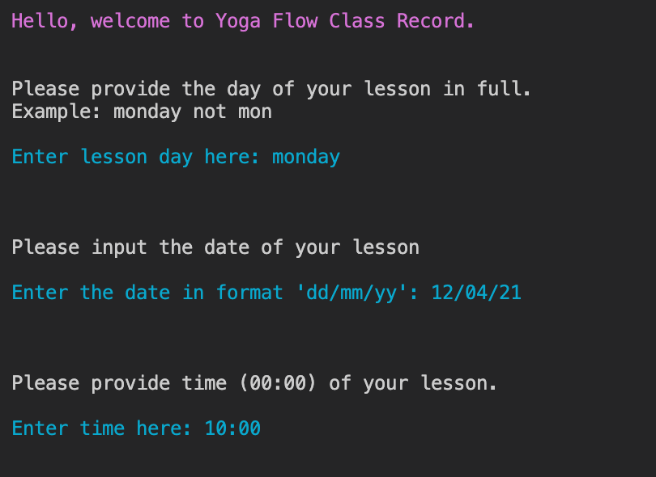
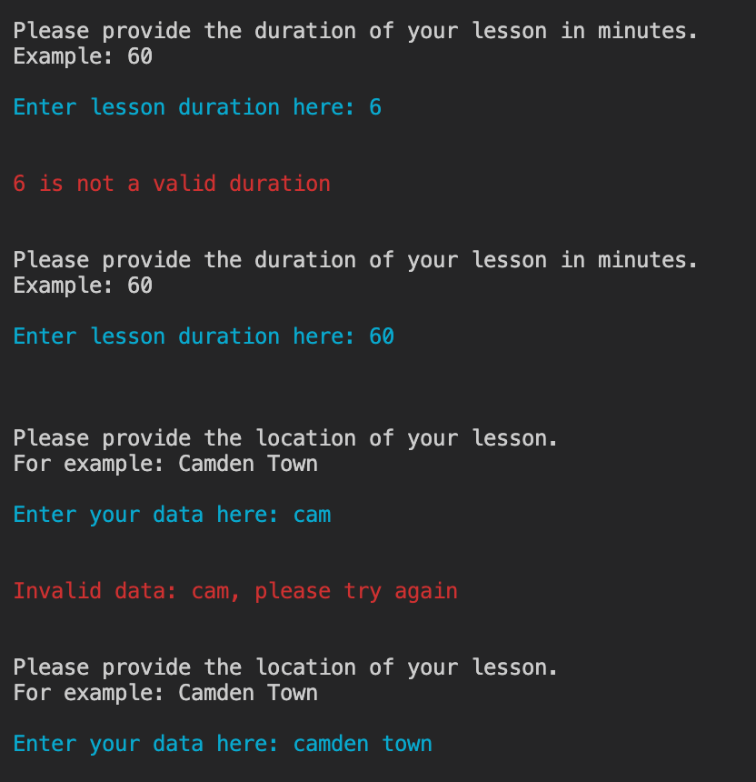
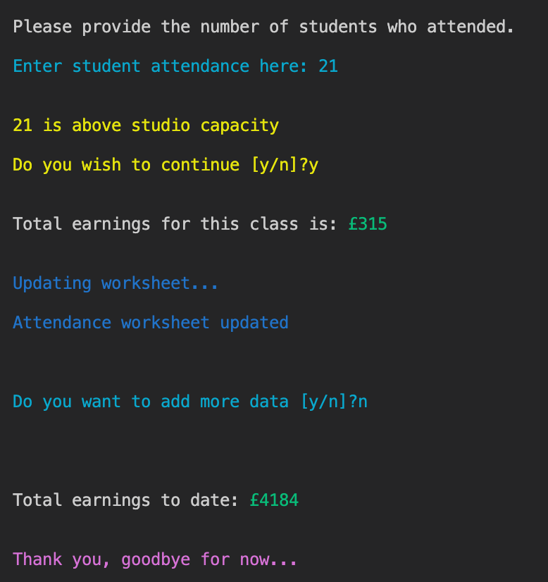
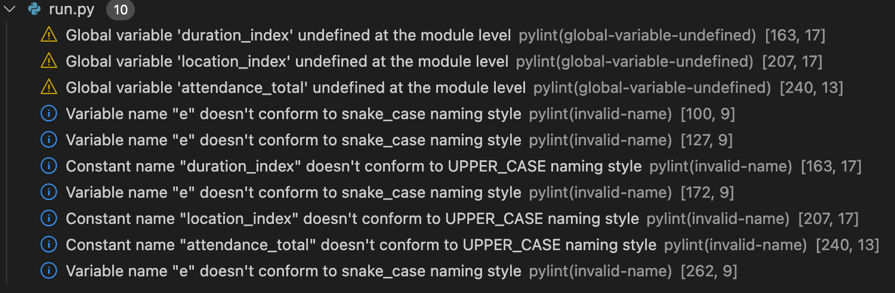

<h1 align="center">Yoga Flow Class Record</h1>

**Live Site:**
[Yoga Flow Class Record Terminal](Link TBC)

**Repository:**
[Yoga Flow Class Record Repository](https://github.com/SamanthaBooth81/yoga-flow-class-record)

# About
This project collects lesson data from the user for the purpose of updating lesson data and calculate earnings. 

It is made with the intention of helping a small business owner keep their financial information in order and keep track of total earnings, both for the lesson added and a running total so far.

# Table of Contents

[User Experience](#user-experience)

[Features](#features)

[Features to be Implemented](#features-to-be-implemented)

[Technologies Used](#technologies-used)

[Testing](#testing)

[Validator Testing](#validator-testing)

[Performancce Testing](#performance-testing)

[Bugs Found](#bugs-found)

[Deployment](#deployment)

[Credit](#credit)

[Acknowledgments](#Acknowledgments)

# User Experience
## User Stories
- As a small business owner I want to:
    * Keep track of the business earnings
    * Plan for the future growth of the business 

# Features
## Input Data
- Input of lesson data including:
    * Day
    * Date
    * Time

 

    * Duration
    * Location 

 

    * Attendance and calculations

 

##  Calculations
- Calculate earnings per class and update spreadsheet
- Calculate the total of all inputted lessons

## Features to be Implemented
- Calculations of the busiest days in the week
- Analytics of the current timetable over the month to decipher:
    - Average student attendance per day
    - Busiest time period throughout the month
    - busiest time period throughout the year

The above should aid with decision making, such as making adjustments to the current timeable, running of workshops (when and where is best) and identifying capacity to add locations/lessons. 

# Technologies Used

## Languages Used

[Python](https://www.python.org/)

## Frameworks, Libraries and Programmes Used 

[GitHub](https://github.com/) - Used to hold a repository of my project and deploy the live website to Git Pages, making it public.

[GitPod](https://gitpod.io/workspaces) – Connected to GitHub, GitPod hosted the coding space, allowing the project to be built and then committed to the GitHub repository. 

[Heroku](https://www.heroku.com/) - Connected to GitHub repositiry, Heroku is a cloud application platform used to deploy this project so this backend language can be utilised/tested. 

[Google Sheets](https://workspace.google.com/intl/en_uk/products/sheets/?utm_source=google&utm_medium=cpc&utm_campaign=emea-gb-all-en-dr-bkws-all-all-trial-e-t1-1010042&utm_content=text-ad-crnurturectrl-none-DEV_c-CRE_146161043432-ADGP_Hybrid%20%7C%20BKWS%20-%20EXA%20%7C%20Txt%20~%20Sheets%20~%20General%20%232-KWID_43700012539607188-kwd-11403239008-userloc_20485&utm_term=KW_google%20sheets-g&ds_rl=1289227&ds_rl=1259922&ds_rl=1289227&gclid=Cj0KCQjwtMCKBhDAARIsAG-2Eu-ikZjdKWgK9omCfFHENiM0V260I6vw4zlmpc1cabn0Jyru79bRzmkaAjFMEALw_wcB&gclsrc=aw.ds) to create an online based spreadsheet.

[Google Sheets API](https://developers.google.com/sheets/api) to link into my spreadsheet.

[datetime](https://docs.python.org/3/library/datetime.html) to work with the date and time.

[Colorama](https://www.youtube.com/watch?v=u51Zjlnui4Y) is used to add colour to the terminal.

# Testing

## Functionality 

I have manually tested the projecy by:
- running through a PEP8 linter
- intentionally added incorrect data to ensure the code rejects it 
- Tested both in Gitpod and Heroku terminals

# Validator Testing

The code was validated using [PEP8](http://pep8online.com/). No errors were retruned. 

# Bugs Found 

During testing I found that the date was not in the dd/mm/yy format I thought I had set it as. To fix this I change the order of the following line of code from "day, month, year" to be "year, month, date":

<ins>my_date = date(int(year), int(month), int(day))</ins>

I also found that some user input errors were terminating the code although I used a while loop. To fix this I identified which lines of code were causing the errors using the Traceback in the terminal. What I found was the code that was causing the break in the loop wasn't within the while loop. To fix this I placed the code in the loop and function began to work as expected.  

Currently, there are no bugs found, however, the below pylint errors were appearing in the Problems tab:

 

I attempted to remove the errors however the variables I have stored globally were not working when moved into the module. Therefore I had to use the global keyword within the following functions:
- lesson_duration_data()
- lesson_location_data
- lesson_attendance_data

# Deployment 

# Credit
## Content 

I used [Stack Overflow](https://stackoverflow.com/questions/3944655/testing-user-input-against-a-list-in-python) to test user input against the lesson_day list.

I used [Stack Overflow](https://stackoverflow.com/questions/3944655/testing-user-input-against-a-list-in-python) to help with the while loop when writing the lesson day function. 

I used this [Gspread Documentation](https://docs.gspread.org/en/latest/user-guide.html#getting-a-cell-value) to find out how to link to a column of data in a spreadsheet.

# Acknowledgments
Thank you to all who encouraged and supported me as I created my first game, espcially to my mentor for his guidance and patience. 
